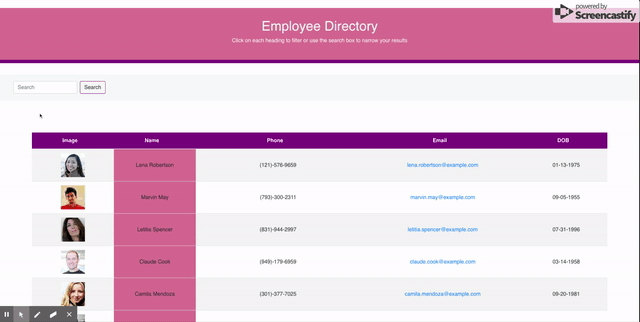

[Author](#author)
<b />
[Contribute](#contribute)
<b />
[Visualization of App Interface](#visualization-of-app-interface)
<b />
[Usage](#usage)
---

### About UserDirectory

REACT web application that allows allowing the user to visualize all Employees pertinent details, search by keyword and filter results.

https://github.com/Noreldin-S/User-Directory

### Live Link to Deployed App

[UserDirectory](https://emplodir.herokuapp.com/)

### Technologies and APIs Used

- React
- NodeJS
- Bootstrap
- Random User API: https://randomuser.me/api/

## Usage

- This is a single page React app

## Visualization of App Interface

## Installation and Setup Instructions

Installation:

`npm install`  

To Start Server:

`npm start`  

To Visit App:

`localhost:3000`  

---
​

## Contribute

Please submit [bugs and feature requests](https://github.com/Noreldin-S/User-Directory/issues/)

### Author

[Noreldin Saad](https://github.com/Noreldin-S/)

